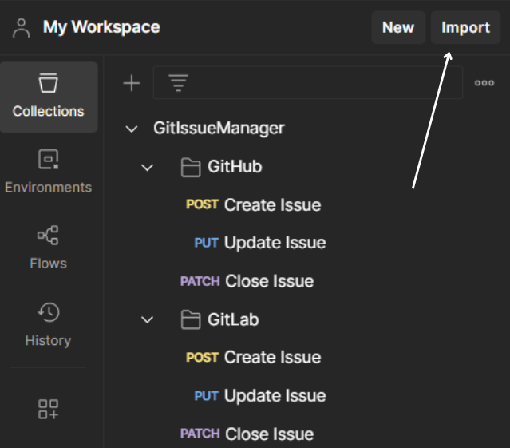

# IssueManager

IssueManager is a simple REST API that allows you to manage issues on GitHub and GitLab repositories.  
It supports the following operations:

- Create a new issue
- Update an existing issue (title and description)
- Close an issue

The application is built with **.NET 10** and uses raw `HttpClient` to communicate directly with Git hosting service APIs (no SDKs or wrappers used).

---

## 🚀 Getting Started

### 🔧 Prerequisites

- [.NET 10 SDK](https://dotnet.microsoft.com/en-us/download/dotnet/10.0)
- A GitHub and/or GitLab account
- Personal access tokens for GitHub and GitLab (see below)

---

### ⚙️ Configuration

In the `IssueManager.API` project, open the `appsettings.json` file and add your tokens:

```json
{
  "GitHub": {
    "Token": "ghp_your_github_token"
  },
  "GitLab": {
    "Token": "glpat_your_gitlab_token"
  }
}
```

---

### 🔧 How to start program without for example Visual Studio


---

### 🚀 Using the API with Postman

The `Postman` directory contains a collection file:  
`GitIssueManager.postman_collection.json`  

#### Steps to import the collection:

1. Open Postman.
2. Go to *Collections* → *Import*.
3. Select the file:  
   `/Postman/GitIssueManager.postman_collection.json`

#### Example: Importing a Collection in Postman  


---

### 🔧 Configuring Requests

After importing the collection, select a request you want to test (e.g., *Create Issue in GitHub*).

Update the required parameters in the request, such as:
- `Account Name`
- `Project Name`

to match your GitHub setup.

#### Example: Editing Variables in Request  


---

## CI/CD


Automated tests are triggered on every commit and pull request to the `main` and `develop` branches using GitHub Actions and xUnit tests.

---
